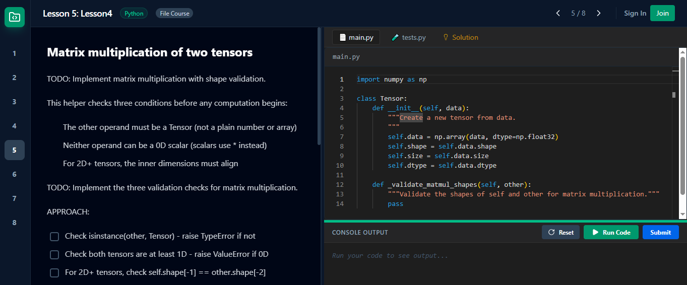

# BaseLayer App

A modern, interactive platform designed for learning and teaching programming through hands-on, file-based exercises. Features an integrated AI assistant, Google Sheets integration for mathematical intuition, and a secure code execution environment.



## Key Features

-   **Interactive Web IDE**: A full-featured code editor with syntax highlighting (Monaco Editor) for Python and Rust.
-   **File-Based Course System**: Courses are loaded directly from the filesystem, making it easy to add content by simply creating folders.
-   **Seamless No-Login Flow**: Just start! Browse and complete courses without mandatory account creation or login prompts.
-   **Secure Code Execution**: Run code safely in a sandboxed environment using Docker (locally) or Modal (cloud).
-   **Integrated AI Coding Assistant**: SocratiQ provides hints, explains concepts, and helps debug exercises with full lesson context (assignment, current code, and tests).
-   **Google Sheets Integration**: Build mechanical intuition for tensors and matrices using familiar spreadsheet formulas like `MMULT` and `ARRAYFORMULA`.
-   **Multi-language Support**: Currently supports Python and Rust execution.

## How It Works

### Frontend Proxy
The frontend (Vite) runs on port **5173** and uses a developer proxy configured in `vite.config.ts` to forward API requests (`/courses`, `/file-courses`, `/run`, etc.) to the backend on port **8000**. This allows for a seamless development experience with cross-origin issues handled automatically.

### Code Execution Sandbox

When you click "Run Code", the backend takes your code and runs it inside a specialized Docker container (`sandbox-runner`). This ensures that your local machine is protected from potentially malicious code and provides a consistent environment.

#### How the Sandbox Works

*The embedded code editor was recently enhanced to ensure the full code is always visible. It now allows scrolling beyond the last line and the container uses `overflow-auto` so long files don't get clipped.*


1. **Code Submission**: Your code is sent to the backend via the `/run` endpoint.
2. **Temp Directory**: The backend creates a temporary directory on the host machine and writes your code to a file (`main.py` for Python or `main.rs` for Rust).
3. **Docker Execution**: The backend runs the `sandbox-runner` Docker image, mounting the temp directory into the container at `/app`.
4. **Code Execution**: Inside the container, Python or Rust executes your code. The environment is isolated and clean for each run.
5. **Output Capture**: Standard output and error streams are captured and returned to the frontend.

#### Where Code Is Written and Executed

- **Host Side**: Your code is written to `/tmp/tmpXXXXXX/main.py` (temporary directory created by Python's `tempfile` module).
- **Container Side**: This directory is mounted as `-v /tmp/tmpXXXXXX:/app`, making your code available at `/app/main.py` inside the container.
- **Execution**: The container runs `cd /app && python main.py`, executing your code in an isolated environment.

#### Adding Libraries to the Sandbox

To add new Python or Rust libraries for use in exercises:

1. **Edit `sandbox/Dockerfile`**:
   ```dockerfile
   RUN pip install numpy torch matplotlib  # Add more packages here
   ```

2. **Rebuild the Docker image**:
   ```bash
   ./dev.sh
   ```

3. **Use in Exercises**: Your new libraries will be available in all future code executions. For example, in a test or course exercise:
   ```python
   import numpy as np
   import torch
   ```

#### Why This Architecture?

- **Security**: Running code in an isolated Docker container prevents malicious student code from affecting the host system.
- **Consistency**: Every execution runs in the same environment, ensuring reproducible results across different machines.
- **Scalability**: When deployed to Modal (cloud), this architecture allows sandboxed execution to run serverlessly without local Docker.
- **Clean Slate**: Each execution gets a fresh Python interpreter, preventing state pollution between runs.
- **Environment Variables**: The backend sets `PYTHONDONTWRITEBYTECODE=1` to prevent Python from creating `__pycache__` directories in the mounted temp folder, avoiding permission issues.

### Dynamic Course Discovery
The backend dynamically scans the `courses/` directory. Any folder that follows the required structure is automatically identified and displayed on the app's homepage upon initialization.

## Getting Started

### Prerequisites

-   **Docker**: Required for local code execution.
-   **Node.js & npm**: For running the frontend.
-   **Python 3.10+**: For the backend.
-   **uv**: Recommended Python package manager ([Installation Guide](https://docs.astral.sh/uv/getting-started/installation/)).

### Local Development

Use the provided `dev.sh` script to start everything in one go:

```bash
./dev.sh
```

This script builds the sandbox image, starts the FastAPI backend (port 8000), and starts the Vite frontend (port 5173).

## Adding New Courses

You can add new courses by simply creating a folder structure in the `courses/` directory.

### Directory Structure
Each course must have at least one lesson folder to be visible in the app.

```text
courses/
└── my-new-course/
    ├── README.md              # (Optional) Course overview description
    └── lesson-1-introduction/
        ├── README.md          # Lesson instructions (Markdown)
        ├── main.py            # Starter code for the student
        ├── test.py            # Automated tests to verify the solution
        └── solution.py        # (Optional) Reference solution code
```

-   **README.md**: Used to display the lesson instructions on the left panel.
-   **main.py**: The code that will be loaded into the editor for the student.
-   **test.py**: Code that is appended to the student's code and executed to verify the results.
-   **solution.py**: Reference code that students can reveal by clicking the "Solution" button. If this file is missing, the button will not be displayed.

### Spreadsheet Exercises
For exercises focused on mathematical intuition, use the `spreadsheet` type in the lesson metadata.
- **google_sheet_id**: Link to a template spreadsheet.
- **copy_on_open**: Automatically prompts the user to make a private copy for editing.


### Multi-language Support
For Rust courses, name your files `main.rs`, `test.rs`, and `solution.rs`. The platform automatically detects the language based on these file extensions.

## Project Structure

-   `backend/`: FastAPI application, database models, and AI services.
    - `main.py`: Core API endpoints including `/run` (code execution handler).
    - `models.py`: SQLModel definitions for courses, exercises, and users.
    - `database.py`: Database initialization and session management.
    - `auth.py`: Authentication and user management routes.
    - `routers/`: Modular API route handlers.
-   `frontend/`: React components, pages, and state management.
    - `pages/CodingPage.tsx`, `FileCodingPage.tsx`: Main exercise execution interfaces.
    - `components/CodeEditor.tsx`: Monaco editor integration.
    - `services/aiService.ts`: AI assistant integration.
-   `courses/`: Local directory where all file-based courses reside (auto-discovered by the backend).
-   `sandbox/`: Dockerfile and related files for the code execution environment.
    - `Dockerfile`: Builds the `sandbox-runner` image with Python, Rust, and required libraries.
-   `dev.sh`: Main orchestration script for local development (builds Docker images and starts services).

## Deployment to Modal

The application is optimized for serverless deployment on [Modal](https://modal.com). This allows the backend and code execution sandboxes to scale automatically.

### Prerequisites

1.  **Modal Account**: Create an account at [modal.com](https://modal.com).
2.  **Modal CLI**: Install the `modal` package:
    ```bash
    pip install modal
    ```
3.  **Authentication**: Authenticate your local machine:
    ```bash
    modal setup
    ```

### Deployment Steps

Before deploying, ensure you have a fresh build of the frontend:

1.  **Build Frontend**:
    ```bash
    cd frontend
    npm install
    npm run build
    ```

2.  **Deploy to Modal**:
    From the `backend` directory, run:
    ```bash
    cd ../backend
    modal deploy modal_app.py
    ```

### Architecture on Modal

-   **Web Endpoint**: The FastAPI app is deployed as an ASGI app. It serves the static frontend files from the `/assets` directory.
-   **Persistent Storage**: A Modal Volume (`code-app-volume`) is used to persist the SQLite database.
-   **Serverless Sandboxes**: When code is executed, the backend spawns a new Modal Sandbox using the `sandbox_image` defined in `modal_app.py`, providing isolation and security without requiring local Docker.
-   **Environment Variables**: The `COURSES_DIR` is set to `/courses` inside the Modal container, where the course files are mounted.