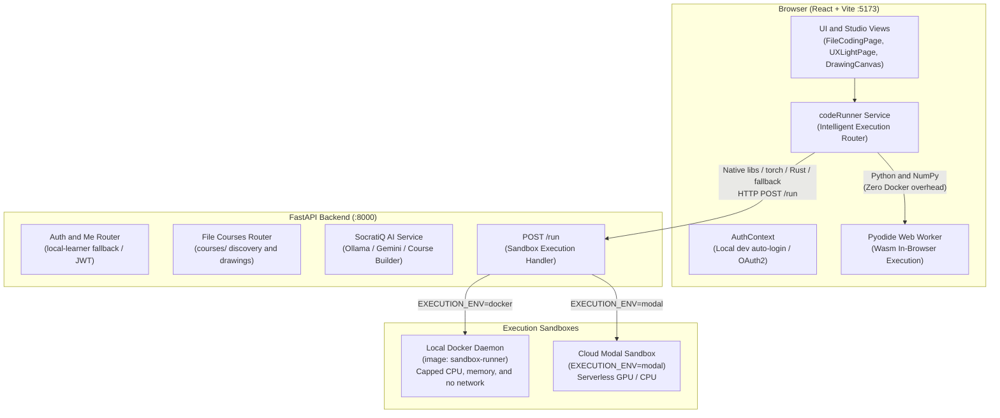

# BaseLayer

An open-source studio for **learning by doing**. You take (or write) file-based exercises in a browser IDE: run Python or Rust in a sandbox, build intuition in Google Sheets, or draw on a diagram. SocratiQ, the built-in tutor, hints without dumping the full solution.


**Studio:** [http://localhost:5173](http://localhost:5173) after `./dev.sh`  
**API:** [http://localhost:8000](http://localhost:8000)

---

## What it does

BaseLayer is not a video platform and not a blank notebook. Each lesson is a folder on disk. Opening a course loads instructions on the left and the matching workspace on the right (editor, sheet, or canvas). You run, inspect, and submit. Tests grade code; a connected LLM grades drawings when one is configured.

| You want to… | What BaseLayer does |
|---|---|
| Learn a shipped course | Pick it on the home page, work lesson by lesson |
| Run code safely | `Run` / `Submit` execute in Docker (local) or Modal (cloud) |
| Get unstuck | Ask **SocratiQ** with the lesson + your current code as context |
| Learn visually | Spreadsheet lessons (`MMULT`, `ARRAYFORMULA`) or hand-drawing on a diagram |
| Track your style | Living `LEARNING.md` profile records struggles, modalities, and signals |
| Teach / customize | Add folders under `courses/` — they show up on refresh |

---

## What's available

### Courses

Anything under `courses/` with at least one lesson folder appears on the home page.

| Course | What you build |
|---|---|
| **tinytorch** | A tiny neural-net library from scratch on NumPy (code, sheets, drawings) |
| **llms-from-scratch** | Llama-style architecture, starting with drawings of the periphery |
| **data-modeling** | Foundational data modeling across five chapters from raw records to structured tables |
| **pytorch** | First tensor exercise |

### Ways to learn (modalities)

| Type | In the player | Good for |
|---|---|---|
| **Code** | Monaco editor, Python or Rust, Run + tests | Implementations, APIs, numerics |
| **Spreadsheet** | Embedded Google Sheet | Shapes, `MMULT`, broadcasting, tensor intuition |
| **Drawing** | Canvas over `question.png` | Data flow, architecture, connections |

Reopen this overview anytime with **Learning Guide** in the header.

### Sandbox libraries (code lessons)

The runner already has **NumPy**, **PyTorch**, and **Matplotlib** (see `research/sandbox/Dockerfile` and the Modal image). Lessons should `import` only what is installed.

### AI & SocratiQ Tutoring (optional)

Pick a provider:
- **Ollama** — 100% free, private, local AI with zero API keys. See the step-by-step [Ollama Setup Guide](docs/ollama_setup.md).
- **Google Gemini** — fastest free cloud path with an AI Studio key.
- **Groq**, **LM Studio**, **OpenAI**, **OpenRouter**, or any OpenAI-compatible custom endpoint.

With a provider configured:

- **SocratiQ** — chat tutor (Solveit / Beginner / Intermediate / Advanced / Bloom’s)
- **Agentic Course Builder** — 4-step tool-calling workflow generating micro-step courses from any topic
- **Drawing grades** — intent, not pixel-perfect match (needs a vision-capable model)

Without a provider, code execution and spreadsheets still work. Configure in the Local Studio **AI Features** tab or `.env`. `GEMINI_API_KEY` still works.

### Living Learner Profile (`LEARNING.md`)

Each learner has a personal profile file at `data/learners/{username}/LEARNING.md` tracking preferred modalities, pace, tutor style, and live learning signals (e.g. test retries, reset exercises, completions). View and edit it anytime from the user menu.

---

## Getting started (run locally)

**Need:** [Docker Desktop](https://www.docker.com/products/docker-desktop/), Node.js, [uv](https://docs.astral.sh/uv/).

```bash
./dev.sh
```

- Frontend: http://localhost:5173  
- Backend: http://localhost:8000  

`./dev.sh` creates the venv and starts API + UI. Copy `.env.example` → `.env` to set a provider (`LLM_PROVIDER` / `LLM_API_KEY`, optional) and `SECRET_KEY` (`SECRET_KEY` is generated for you in local/Docker dev if empty).

**Stuck**

- `uv` not found → put `~/.cargo/bin` (or uv’s install dir) on `PATH`
- Code won’t run → Docker Desktop is running
- Ports busy → free **8000** (API) and **5173** (Vite)

### Docker Compose (whole stack in containers)

Prefer `./docker-compose.yml` when you want every service containerized:

```bash
./docker-dev.sh            # generates .env.docker from .env, builds, starts
./docker-dev.sh logs       # follow logs
./docker-dev.sh down
```

The compose backend never mounts the Docker socket (security), so it runs student
code through the **remote Modal sandbox** (`EXECUTION_ENV=modal`, the same engine
production uses). For that, put Modal credentials in `.env`
(`MODAL_TOKEN_ID` / `MODAL_TOKEN_SECRET`, from `modal token new`) and have the app
reachable (deployed with `modal deploy modal_app.py`, see [Deploy (Modal)](#deploy-modal)).
The compose frontend reads `VITE_GOOGLE_CLIENT_ID` from `.env` (same value as
`GOOGLE_CLIENT_ID`); leave it unset to hide “Sign in with Google”.

No Modal account? Run the stack on the host with `./dev.sh` instead — the backend
then executes student code against your **local Docker daemon** using the
`sandbox-runner` image (built automatically from `research/sandbox`).

---

## Build a course with the Agentic Workflow

Click **Build a course** on the courses page and describe what you want to learn (e.g. `NumPy broadcasting and matrix multiplication`). You can optionally paste documentation excerpts, formulas, or code snippets.

The backend executes a 4-step agentic workflow defining explicit tool calls:

1. **`get_learning_intent`**: Analyzes the topic, extracts core target concepts, extracts snippets from learner materials, and searches existing platform courses for conceptual anchors.
2. **`get_context_learning`**: Retrieves the learner's profile (`data/learners/{user}/LEARNING.md`) or initializes an adaptive profile (understanding level, pace, preferred modalities).
3. **`get_platform_content_tools`**: Inspects platform capabilities across Coding Studio (sandbox libraries: `numpy`, `torch`, `matplotlib`), Google Sheets workspaces (`MMULT`, `ARRAYFORMULA`), and Hand Drawing canvases.
4. **`curate_solveit_course`**: Curates the curriculum under the Solveit methodology (Fast.ai / Answer.AI):
   - **Toy Data**: 3-5 rows or small tensor stated with expected output *before* execution.
   - **Micro-Steps**: Tasks require only 1 to 3 logical lines of code.
   - **Live Inspection**: Prompt to inspect intermediate state immediately.
   - **Curiosity Loop**: Reflection or simplification question at the end of each lesson.
   - **Narrative Arc**: A cohesive storyline connecting the lessons from intuition to working implementation.

The workflow materializes the course into the `courses/` directory so it is immediately playable in the BaseLayer IDE.

---

## Exercise types

### Coding (default)

```text
courses/my-course/my-lesson/
├── README.md
├── main.py      # starter
├── test.py      # run on Submit
└── solution.py  # optional
```

Rust: `main.rs`, `test.rs`, `solution.rs`. Language is detected from the extension. No `metadata.json` required.

### Spreadsheet

```text
courses/my-course/my-lesson/
├── README.md
└── metadata.json
```

```json
{
  "exercise_type": "spreadsheet",
  "google_sheet_id": "YOUR_GOOGLE_SHEET_ID_HERE",
  "copy_on_open": true
}
```

Sheet ID is the path segment in `https://docs.google.com/spreadsheets/d/SHEET_ID/edit`. See [`docs/google_sheets_guide.md`](docs/google_sheets_guide.md).

### Hand drawing

```text
courses/my-course/chapter1/my-lesson/
├── README.md
├── metadata.json
├── question.png
└── solution.png   # optional, improves grading
```

```json
{
  "exercise_type": "drawing",
  "stroke_color": "#e11d48",
  "stroke_width": 4
}
```

Nested lessons get slug `{chapter}--{lesson}` (e.g. `chapter1--lesson1`). A vision-capable LLM grades using instructions, `question.png`, optional `solution.png`, and the sketch. Toolbar: pencil, eraser, color, width, undo, clear.

---

## How it works (architecture)


```mermaid
flowchart TB
    subgraph Client["Browser (React + Vite :5173)"]
        direction TB
        UI["UI and Studio Views<br/>(FileCodingPage, UXLightPage, DrawingCanvas)"]
        Auth["AuthContext<br/>(Local dev auto-login / OAuth2)"]
        Router["codeRunner Service<br/>(Intelligent Execution Router)"]
        Pyodide["Pyodide Web Worker<br/>(Wasm In-Browser Execution)"]

        UI --> Router
        Router -->|"Python and NumPy<br/>(Zero Docker overhead)"| Pyodide
    end

    subgraph Backend["FastAPI Backend (:8000)"]
        direction TB
        AuthBackend["Auth and Me Router<br/>(local-learner fallback / JWT)"]
        CoursesBackend["File Courses Router<br/>(courses/ discovery and drawings)"]
        AI["SocratiQ AI Service<br/>(Ollama / Gemini / Course Builder)"]
        RunEndpoint["POST /run<br/>(Sandbox Execution Handler)"]
    end

    Router -->|"Native libs / torch / Rust / fallback<br/>HTTP POST /run"| RunEndpoint

    subgraph Sandboxes["Execution Sandboxes"]
        DockerDaemon["Local Docker Daemon<br/>(image: sandbox-runner)<br/>Capped CPU, memory, and no network"]
        ModalCloud["Cloud Modal Sandbox<br/>(EXECUTION_ENV=modal)<br/>Serverless GPU / CPU"]
    end

    RunEndpoint -->|"EXECUTION_ENV=docker"| DockerDaemon
    RunEndpoint -->|"EXECUTION_ENV=modal"| ModalCloud
```

### Architectural Pillars

1. **Hybrid Execution Engine (`codeRunner`)**:
   - **In-Browser WebAssembly (Pyodide)**: Runs pure Python and NumPy code directly inside an isolated browser Web Worker with dynamic ESM imports. Exercises like TinyTorch run instantly with ~0ms latency, require zero Docker daemon, and consume no backend compute.
   - **Backend Sandbox Fallback (`/run`)**: Code importing native C++ extensions like PyTorch (`import torch`), Transformers, or Rust automatically routes to the backend sandbox.
   - **Execution Sandboxing**: Backend runs are isolated via Docker (`sandbox-runner` image with memory, CPU, and process caps and no network access) or remote serverless sandboxes via Modal (`EXECUTION_ENV=modal`).

2. **Frictionless Local Auth & File System Discovery**:
   - Courses are simple folder hierarchies under `courses/` (`README.md`, `main.py`, `test.py`, `metadata.json`).
   - On `localhost`, `ALLOW_LOCAL_WELCOME=true` automatically drops the learner into a local development session (`local-learner`), removing sign-in walls when exploring courses locally.

3. **Multi-Modal Learning Studio**:
   - **Interactive Code**: Monaco editor with real-time test verification and student/author test visibility.
   - **Spreadsheet Integration**: Live Google Sheets embeds for visual tensor operations (`MMULT`, `ARRAYFORMULA`, broadcasting).
   - **Freehand Canvas**: Drawing exercises evaluated against architectural questions using multimodal vision LLMs.
   - **Adaptive Tutoring & Profiling**: SocratiQ AI tutor using the Solveit method and living `data/learners/{user}/LEARNING.md` profile tracking mastery signals.

---

## Core Features

- **Zero-Install Client Execution**: Test-drive Python and NumPy exercises in WebAssembly directly in Chrome/Firefox/Safari without starting Docker.
- **File-Based Curriculums**: Build and share courses as standard markdown and python files in Git.
- **Multi-Modal Workspaces**: Code exercises, interactive Google Sheets, and freehand drawing diagrams on one platform.
- **SocratiQ Pedagogical AI Tutor**: Socratic hints and guided questions without code dumping; supports Ollama, Gemini, Groq, OpenAI, and OpenRouter.
- **Agentic Course Builder**: 4-step tool-calling agent generating micro-step curricula adapted to your personal learning profile.
- **Living Learner Profile (`LEARNING.md`)**: Durable tracking of struggle signals, test attempts, velocity, and modality preferences.
- **Dual Deployment**: Run 100% locally on your machine or deploy serverless to Modal cloud with one command.

---

## Project layout

- `backend/` — FastAPI, `/run`, AI, auth, `routers/file_courses.py`, `routers/me.py`, `learner_profile.py`
- `frontend/` — React studio (classic + UX Light player, `CourseBuilder`, `LearningProfileModal`)
- `courses/` — all file-based curricula
- `docs/` — AI setup, sheets, Modal, lesson script
- `research/` — sandbox image and experiments
- `dev.sh` / `docker-dev.sh` — local start

---

## Deploy (Modal)

```bash
cd frontend && npm install && npm run build
cd ../backend && modal deploy modal_app.py
```

Needs a [Modal](https://modal.com) account (`pip install modal` then `modal setup`). The app serves the built UI, keeps SQLite on volume `code-app-volume`, and runs code in serverless sandboxes. `COURSES_DIR=/courses` inside the container. Guide: [`docs/modal_deployment_guide.md`](docs/modal_deployment_guide.md).
