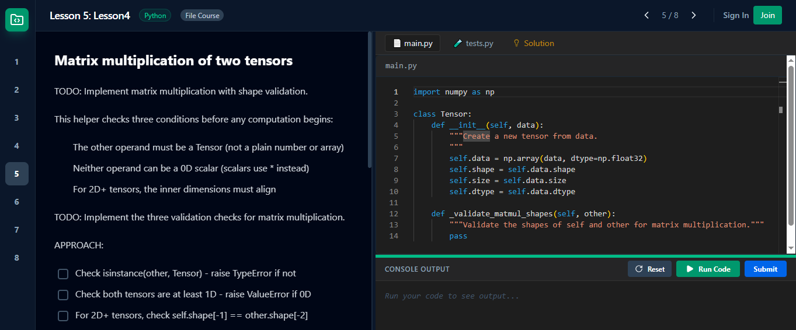

# BaseLayer

An open-source studio for **learning by doing**. You take (or write) file-based exercises in a browser IDE: run Python or Rust in a sandbox, build intuition in Google Sheets, or draw on a diagram. SocratiQ, the built-in tutor, hints without dumping the full solution.



**Studio:** [http://localhost:5173](http://localhost:5173) after `./dev.sh`  
**API:** [http://localhost:8000](http://localhost:8000)

---

## What it does

BaseLayer is not a video platform and not a blank notebook. Each lesson is a folder on disk. Opening a course loads instructions on the left and the matching workspace on the right (editor, sheet, or canvas). You run, inspect, and submit. Tests grade code; Gemini grades drawings when a key is configured.

| You want to… | What BaseLayer does |
|---|---|
| Learn a shipped course | Pick it on the home page, work lesson by lesson |
| Run code safely | `Run` / `Submit` execute in Docker (local) or Modal (cloud) |
| Get unstuck | Ask **SocratiQ** with the lesson + your current code as context |
| Learn visually | Spreadsheet lessons (`MMULT`, `ARRAYFORMULA`) or hand-drawing on a diagram |
| Teach / customize | Add folders under `courses/` — they show up on refresh |

---

## What's available

### Courses

Anything under `courses/` with at least one lesson folder appears on the home page.

| Course | What you build |
|---|---|
| **tinytorch** | A tiny neural-net library from scratch on NumPy (code, sheets, drawings) |
| **llms-from-scratch** | Llama-style architecture, starting with drawings of the periphery |
| **pytorch** | First tensor exercise |

### Ways to learn (modalities)

| Type | In the player | Good for |
|---|---|---|
| **Code** | Monaco editor, Python or Rust, Run + tests | Implementations, APIs, numerics |
| **Spreadsheet** | Embedded Google Sheet | Shapes, `MMULT`, broadcasting, tensor intuition |
| **Drawing** | Canvas over `question.png` | Data flow, architecture, connections |

Reopen this overview anytime with **Learning Guide** in the header.

### Sandbox libraries (code lessons)

The runner already has **NumPy**, **PyTorch**, and **Matplotlib** (see `research/sandbox/Dockerfile` and the Modal image). Lessons should `import` only what is installed.

### AI (optional)

With a Gemini key:

- **SocratiQ** — chat tutor (Beginner / Intermediate / Advanced / Bloom’s)
- **Drawing grades** — intent, not pixel-perfect match
- **Exercise generation** — admin `POST /ai/generate/exercise`

Without a key, code execution and spreadsheets still work; tutoring and sketch grading pause.

### Local studio extras

On first local open you set a **name** (no account required) and can paste `GEMINI_API_KEY` into the UI (saved to `.env`). Details: [`docs/local_ai_and_learning_options.md`](docs/local_ai_and_learning_options.md).

---

## How to use it (learner)

1. **Start the studio** (below) and open http://localhost:5173.
2. Enter a name when asked. Optionally save a Gemini key (or skip).
3. Skim **Learning Guide** (modalities + how to add your own folders).
4. Open a course card. Work the lesson:
   - **Code:** edit `main.py` / `main.rs` → **Run** (stdout) → **Submit** (tests).
   - **Sheet:** copy the Google Sheet if prompted, use the formulas in the README.
   - **Draw:** pencil / eraser / undo; submit for AI grading when AI is on.
5. Use **SocratiQ** for hints. It sees the assignment and your current code; it should not paste the hidden solution.
6. **Solution** appears only if the lesson has `solution.py` / `solution.rs` and you click it.

Progress is local to this machine unless you sign in.

---

## How to add or customize a course

Drop a folder in `courses/`. The backend scans the directory; refresh the home page.

```text
courses/
└── my-course/
    ├── README.md                 # Course blurb on the home card
    └── lesson-1-introduction/    # or chapter1/lesson01/
        ├── README.md             # Left-panel instructions
        ├── main.py               # Starter (or main.rs)
        ├── test.py               # Appended and run on Submit
        └── solution.py           # Optional; unlocks the Solution button
```

Helper: [`docs/create_lesson_guide.md`](docs/create_lesson_guide.md) (`backend/scripts/create_lesson.py`).

**Spreadsheet** lessons need `metadata.json` with `exercise_type: "spreadsheet"` and `google_sheet_id`.  
**Drawing** lessons need `exercise_type: "drawing"` plus `question.png` (optional `solution.png`).

Full file layouts are in [Exercise types](#exercise-types) below.

---

## Getting started (run locally)

**Need:** [Docker Desktop](https://www.docker.com/products/docker-desktop/), Node.js, [uv](https://docs.astral.sh/uv/).

```bash
./dev.sh
```

- Frontend: http://localhost:5173  
- Backend: http://localhost:8000  

`./dev.sh` creates the venv, offers a Gemini key if missing, and starts API + UI. Copy `.env.example` → `.env` if you prefer to set `GEMINI_API_KEY` and `SECRET_KEY` yourself (`SECRET_KEY` is generated for you in local/Docker dev if empty).

**Stuck**

- `uv` not found → put `~/.cargo/bin` (or uv’s install dir) on `PATH`
- Code won’t run → Docker Desktop is running
- Ports busy → free **8000** (API) and **5173** (Vite)

---

## Build a course by asking (in progress)

Shipped today: you take the courses above or write folders yourself.

Next: type **what you want to learn** (example: “I want to learn numpy”). Docs, articles, or code are optional. BaseLayer should build a **playable** course from that question — Solveit-style micro-lessons (tiny toy data, 1–3 line tasks, inspect the output), using what this repo already has (sandbox NumPy/PyTorch, existing `courses/`, sheets, drawing, SocratiQ), and your learning style when a profile exists.

Tracked as:

| Issue | Piece |
|---|---|
| [#36](https://github.com/sotoblanco/BaseLayer/issues/36) | Ask (topic enough; examples optional) |
| [#38](https://github.com/sotoblanco/BaseLayer/issues/38) | Plan grounded in platform resources |
| [#39](https://github.com/sotoblanco/BaseLayer/issues/39) | Write real lesson files |
| [#40](https://github.com/sotoblanco/BaseLayer/issues/40) | Verify they run in the sandbox |
| [#41](https://github.com/sotoblanco/BaseLayer/issues/41) | Customize from Learning Guide / `LEARNING.md` |
| [#37](https://github.com/sotoblanco/BaseLayer/issues/37) | Solveit tutor mode |
| [#44](https://github.com/sotoblanco/BaseLayer/issues/44) | One action: question → course you can open |

Until those land, add courses as folders (previous section).

---

## Exercise types

### Coding (default)

```text
courses/my-course/my-lesson/
├── README.md
├── main.py      # starter
├── test.py      # run on Submit
└── solution.py  # optional
```

Rust: `main.rs`, `test.rs`, `solution.rs`. Language is detected from the extension. No `metadata.json` required.

### Spreadsheet

```text
courses/my-course/my-lesson/
├── README.md
└── metadata.json
```

```json
{
  "exercise_type": "spreadsheet",
  "google_sheet_id": "YOUR_GOOGLE_SHEET_ID_HERE",
  "copy_on_open": true
}
```

Sheet ID is the path segment in `https://docs.google.com/spreadsheets/d/SHEET_ID/edit`. See [`docs/google_sheets_guide.md`](docs/google_sheets_guide.md).

### Hand drawing

```text
courses/my-course/chapter1/my-lesson/
├── README.md
├── metadata.json
├── question.png
└── solution.png   # optional, improves grading
```

```json
{
  "exercise_type": "drawing",
  "stroke_color": "#e11d48",
  "stroke_width": 4
}
```

Nested lessons get slug `{chapter}--{lesson}` (e.g. `chapter1--lesson1`). Gemini grades using instructions, `question.png`, optional `solution.png`, and the sketch. Toolbar: pencil, eraser, color, width, undo, clear.

---

## How it works (architecture)

**Proxy.** Vite (`5173`) forwards `/file-courses`, `/run`, `/ai`, … to FastAPI (`8000`).

**Discovery.** The API scans `courses/` on request. New folders appear after refresh.

**Run.** Submit sends code to `/run`. The backend writes `main.py` or `main.rs` in a temp dir, runs `sandbox-runner` (or a Modal sandbox in the cloud), returns stdout/stderr. Each run is a clean interpreter (`PYTHONDONTWRITEBYTECODE=1`).

**Add a library to the sandbox**

1. Install it in the sandbox image (local Dockerfile under `research/sandbox/` and/or `sandbox_image` in `backend/modal_app.py`).
2. Rebuild (`./dev.sh` locally).
3. Use it in `main.py` / tests.

---

## Project layout

- `backend/` — FastAPI, `/run`, AI, auth, `routers/file_courses.py`
- `frontend/` — React studio (classic + UX Light player)
- `courses/` — all file-based curricula
- `docs/` — AI setup, sheets, Modal, lesson script
- `research/` — sandbox image and experiments
- `dev.sh` / `docker-dev.sh` — local start

---

## Deploy (Modal)

```bash
cd frontend && npm install && npm run build
cd ../backend && modal deploy modal_app.py
```

Needs a [Modal](https://modal.com) account (`pip install modal` then `modal setup`). The app serves the built UI, keeps SQLite on volume `code-app-volume`, and runs code in serverless sandboxes. `COURSES_DIR=/courses` inside the container. Guide: [`docs/modal_deployment_guide.md`](docs/modal_deployment_guide.md).
