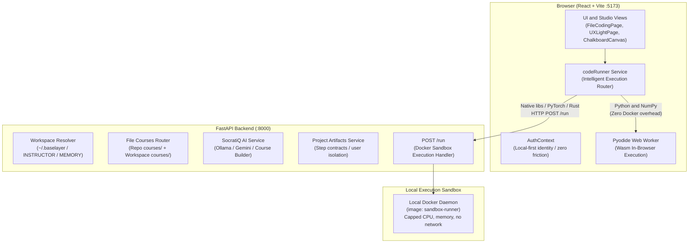

# BaseLayer

An open-source, local-first studio for **learning by doing**. You take (or write) file-based exercises in a browser IDE: run Python or Rust in a sandbox, build intuition in Google Sheets, or draw on a realistic chalkboard. SocratiQ, the built-in tutor, hints without dumping the full solution.


**Studio:** [http://localhost:5173](http://localhost:5173) after `baselayer up` or `./dev.sh`  
**API:** [http://localhost:8000](http://localhost:8000)

---

## What it does

BaseLayer is not a video platform and not a blank notebook. Each lesson is a folder on disk. Opening a course loads instructions on the left and the matching workspace on the right (editor, sheet, or canvas). You run, inspect, and submit. Pure Python and NumPy execute instantly in-browser via WebAssembly, while native code runs in an isolated local Docker container.

| You want to... | What BaseLayer does |
|---|---|
| Learn a shipped course | Pick it on the home page, work lesson by lesson |
| Onboard and configure | Run `baselayer onboard` to set up workspace, tutor style, and AI keys |
| Run code instantly | Client-side Pyodide WebAssembly executes Python and NumPy with zero Docker overhead |
| Run native code safely | PyTorch, native C extensions, and Rust execute in an isolated local Docker container |
| Build real projects | Build-Project mode chains sequential steps that accumulate one working artifact |
| Learn visually | Spreadsheet lessons (`MMULT`, `ARRAYFORMULA`) and realistic chalkboard drawings |
| Self-evaluate drawings | Pure-JSON chalkboard lessons compare with solution cards without requiring AI |
| Get unstuck | Ask **SocratiQ** with the lesson, your current code, and learning history as context |
| Personalize tutoring | Living `LEARNING.md` profile records struggles, modalities, pace, and mastery signals |
| Teach and customize | Add folders under `courses/` or your local workspace; they appear immediately |

---

## What's available

### Courses

The studio automatically discovers courses from both the repository `courses/` directory and your local workspace `~/.baselayer/courses/`.

| Course | Modality / Mode | What you build |
|---|---|---|
| **tinytorch** | Code, Sheets, Drawings | A tiny neural-net library from scratch on NumPy |
| **llms-from-scratch** | Code, Drawings | Llama-style architecture, starting with drawings of the periphery |
| **tabular-project** | Build-Project Mode | End-to-end data pipeline accumulating artifacts across 3 connected steps |
| **demo-modalities** | Code, Sheets, Chalkboard | Comprehensive showcase of all three learning modalities |
| **ai-by-hand-embeddings** | Chalkboard | 2D vector coordinate spaces and token embeddings on a slate board |
| **data-modeling** | Code, Sheets | Foundational data modeling across five chapters from raw records to tables |
| **pytorch** | Code | Tensor manipulation and deep learning primitives |

### Ways to learn (modalities and modes)

| Type | In the player | Good for |
|---|---|---|
| **Code** | Monaco editor, Python or Rust, Run + tests | Implementations, algorithms, APIs, numerics |
| **Spreadsheet** | Embedded Google Sheet or declarative cells | Shapes, `MMULT`, broadcasting, tensor intuition |
| **Chalkboard** | Green slate board, chalk tools, diagram solution | Data flow, vector spaces, architecture, self-evaluation |
| **Build-Project** | Sequentially locked steps with artifact contracts | Pipelines and libraries where Step N builds on Step N-1 |

Reopen this overview anytime with **Learning Guide** in the header.

### Execution environments

- **In-Browser WebAssembly (Pyodide)**: Pure Python and NumPy lessons run directly in an isolated browser Web Worker. Submissions execute with sub-millisecond latency and require zero background daemons.
- **Local Docker Sandbox**: Exercises requiring native extensions, PyTorch (`import torch`), or Rust automatically route to `POST /run` against the local `sandbox-runner` Docker image (built automatically with capped memory, CPU, and no network).

### AI & SocratiQ Tutoring (optional)

Pick a provider:
- **Ollama** — 100% free, private, local AI with zero API keys. See the step-by-step [Ollama Setup Guide](docs/ollama_setup.md).
- **Google Gemini** — Fast cloud path with an AI Studio key.
- **Groq**, **LM Studio**, **OpenAI**, **OpenRouter**, or any OpenAI-compatible custom endpoint.

With a provider configured:
- **SocratiQ** — Chat tutor (Solveit, Beginner, Intermediate, Advanced, Bloom's) tailored to your learning pace.
- **Agentic Course Builder** — 4-step tool-calling workflow generating micro-step courses from any topic with depth control and preview gating.
- **Drawing grading** — Optional automated rubric evaluation for diagrams using vision-capable models.

Without a provider, code execution, spreadsheets, and chalkboard self-evaluation still work completely offline.

### Living Learner Profile (`LEARNING.md`) & Workspace

Each learner's profile lives at `~/.baselayer/data/learners/{username}/LEARNING.md` (or in the repository `data/learners/`). It tracks preferred modalities, pace, tutor style, and live learning signals (e.g. test retries, reset exercises, completions). Global defaults are defined in `INSTRUCTOR.md`, and cross-session progress is recorded in `MEMORY.md`.

---

## Getting started (run locally)

### Prerequisites

- Node.js (v18+)
- [uv](https://docs.astral.sh/uv/) (Python package manager)
- [Docker Desktop](https://www.docker.com/products/docker-desktop/) (needed for native/PyTorch/Rust execution)

---

### Option 1: BaseLayer CLI (Recommended)

The `baselayer` CLI is a zero-dependency local manager:

```bash
# Link the CLI globally or run directly from checkout
npm install -g ./cli

# 1. Run the interactive onboarding wizard
baselayer onboard

# 2. Check environment and toolchain health
baselayer doctor

# 3. Start the studio
baselayer up
```

The onboarding wizard asks for your username, target learning goals, tutor style, and optional AI keys, creating your workspace at `~/.baselayer` with validated configuration.

To run non-interactively:
```bash
baselayer onboard --username ada --provider gemini --api-key YOUR_KEY --non-interactive
```

To run completely offline without AI:
```bash
baselayer onboard --username ada --skip-ai --non-interactive
```

---

### Option 2: Host startup script

You can also start the studio directly using the repository helper:

```bash
./dev.sh
```

- Frontend: http://localhost:5173  
- Backend: http://localhost:8000  

`./dev.sh` initializes the Python virtual environment, installs dependencies via `uv`, builds the local Docker sandbox image, and launches both backend and frontend.

Copy `.env.example` to `.env` if you wish to configure an LLM provider (`LLM_PROVIDER` / `LLM_API_KEY`) on the host. `SECRET_KEY` is optional locally (a stable dev key is used automatically across restarts).

#### Troubleshooting

- `uv` not found: Ensure `~/.cargo/bin` (or uv install directory) is in your `PATH`.
- Code execution fails: Verify Docker Desktop is running (`docker ps`). Pure Python/NumPy exercises will still run via in-browser Pyodide even without Docker.
- Ports busy: Ensure ports **8000** (API) and **5173** (Vite) are free.

---

### Option 3: Docker Compose

To run the frontend and backend services inside containers:

```bash
./docker-dev.sh            # generates .env.docker from .env, builds, starts
./docker-dev.sh logs       # follow logs
./docker-dev.sh down
```

---

## Local-First Architecture and Identity

BaseLayer is designed around a local-first philosophy with zero cloud lock-in. For technical details, see the [Local-First Architecture Guide](docs/local_first_setup.md).

- **Zero-Friction Identity**: No sign-up walls, passwords, or OAuth credentials. The studio resolves your active identity from your local workspace or defaults seamlessly to `local-learner`.
- **Local Workspace (`~/.baselayer`)**:
  - `.env`: Validated provider keys and local configuration.
  - `config.json`: Workspace metadata.
  - `INSTRUCTOR.md`: Global pedagogical preferences (tone, pace, explanation depth).
  - `MEMORY.md`: Shared progress and notes digest updated as you complete lessons.
  - `data/learners/{user}/LEARNING.md`: Durable learner profile.
  - `courses/`: Directory where AI-generated courses are saved.
- **Union Course Catalog**: Automatically merges courses from the repository `courses/` directory and your local workspace `~/.baselayer/courses/`.
- **Git Isolation for Personal Courses**: Courses created in `~/.baselayer/courses/` or configured via `BASELAYER_COURSES_DIR` reside outside the Git repository, protecting your work from branch changes or `git pull` updates. For in-tree development, `courses/local/` and prefixes (`courses/local-*/`, `courses/custom-*/`, `courses/my-*/`) are ignored by Git and discovered automatically.
- **Terminal Profile Builder**: Configure or inspect your profile at any time:
  ```bash
  uv run python backend/scripts/build_profile.py
  ```

---

## Build a course with the Agentic Workflow

Click **Build a course** on the courses page and describe what you want to learn (e.g. `NumPy broadcasting and matrix multiplication`). You can optionally paste documentation excerpts, formulas, or code snippets.

The backend executes a 4-step agentic workflow:

1. **`get_learning_intent`**: Analyzes the topic, extracts core target concepts, extracts snippets from learner materials, and searches existing platform courses for conceptual anchors.
2. **`get_context_learning`**: Retrieves the learner's profile (`~/.baselayer/data/learners/{user}/LEARNING.md`) to adapt the curriculum to your pace, experience level, and preferred learning modalities.
3. **`get_platform_content_tools`**: Inspects platform capabilities across Coding Studio (NumPy, PyTorch, Matplotlib), Google Sheets workspaces (`MMULT`, `ARRAYFORMULA`), and Chalkboard canvases.
4. **`curate_solveit_course`**: Curates the curriculum following the Solveit methodology:
   - **Concept First**: Lesson 1 is always a foundations explainer.
   - **Structure**: Topic -> Explanation -> Example (sample data) -> Assignment.
   - **Sources**: Includes cited source references (`source_refs`) to official documentation, RFCs, and papers.
   - **Modality Blend**: Harmonious mix of code, spreadsheet, and drawing exercises tailored to the topic.
   - **Interactive Preview Gate**: Choose course depth (Auto, Short, Standard, Deep) with AI-suggested lesson count, and review or edit the full lesson outline before writing files to disk.

The workflow materializes the course into your workspace `courses/` directory (or repo `courses/`), where it is immediately playable in the BaseLayer IDE.

---

## Exercise types and modes

### 1. Coding (default)

```text
courses/my-course/my-lesson/
├── README.md
├── main.py      # starter code
├── test.py      # automated verification run on Submit
└── solution.py  # optional reference solution
```

Rust: `main.rs`, `test.rs`, `solution.rs`. Language is detected automatically from the file extension. No `metadata.json` is required for standard coding exercises.

### 2. Spreadsheet

```text
courses/my-course/my-lesson/
├── README.md
└── metadata.json
```

```json
{
  "exercise_type": "spreadsheet",
  "google_sheet_id": "YOUR_GOOGLE_SHEET_ID_HERE",
  "copy_on_open": true
}
```

Supports live Google Sheets embeds as well as declarative cell templates. See the [Google Sheets Guide](docs/google_sheets_guide.md).

### 3. Chalkboard and Hand Drawing

```text
courses/my-course/chapter1/my-lesson/
├── README.md
└── metadata.json
```

```json
{
  "exercise_type": "hand_drawn",
  "board_theme": "chalkboard",
  "stroke_color": "#f8fafc",
  "stroke_width": 3,
  "drawing": {
    "prompt_text": "Draw 2D vector plane with King [0.9, 0.1] and Queen [0.8, 0.3], showing angle theta.",
    "solution_diagram": "      y ^\n        |\n  0.3 - |       * Queen [0.8, 0.3]\n  0.1 - |         * King [0.9, 0.1]\n        +-------------> x\n             0.8 0.9",
    "solution_explanation": "King and Queen vectors point in almost the same direction into the positive quadrant, forming an acute angle theta (~10 degrees)."
  }
}
```

Renders a realistic dark green chalkboard with colored chalk tools. When learners submit their sketch, a reference solution card appears showing the solution diagram and theoretical explanation. Learners can self-evaluate by clicking **"I evaluated my drawing — mark complete"**, which emits completion events and awards XP without requiring an AI vision model. If an AI vision provider is configured, automated rubric grading is also supported. See the [Chalkboard Guide](docs/chalkboard_hand_drawn_guide.md).

### 4. Build-Project Mode

A course can be configured as a multi-step accumulating project by placing a `project.json` in the course root (or setting `"is_project": true` in `metadata.json`):

```json
{
  "is_project": true,
  "title": "Tabular Data Pipeline",
  "description": "Build an end-to-end data processing and prediction pipeline across 3 connected steps.",
  "steps": [
    { "slug": "step01-ingest", "consumes": [], "produces": "dataset.csv" },
    { "slug": "step02-scale", "consumes": ["dataset.csv"], "produces": "scaled_data.py" },
    { "slug": "step03-predict", "consumes": ["dataset.csv", "scaled_data.py"], "produces": "predictions.csv" }
  ]
}
```

In Build-Project mode:
- Each step defines `consumes` (prerequisite files) and `produces` (the generated output artifact).
- Unfinished subsequent steps are locked in the player until prerequisite artifacts are produced.
- Upon successful submission, the produced artifact is saved to user storage (`learners/{user}/projects/{course}/`) and automatically injected into subsequent steps.
- See the [Build-Project Mode Guide](docs/build_project_mode.md).

---

## How it works (architecture)


```mermaid
flowchart TB
    subgraph Client["Browser (React + Vite :5173)"]
        direction TB
        UI["UI and Studio Views<br/>(FileCodingPage, UXLightPage, ChalkboardCanvas)"]
        Auth["AuthContext<br/>(Local-first identity / zero friction)"]
        Router["codeRunner Service<br/>(Intelligent Execution Router)"]
        Pyodide["Pyodide Web Worker<br/>(Wasm In-Browser Execution)"]

        UI --> Router
        Router -->|"Python and NumPy<br/>(Zero Docker overhead)"| Pyodide
    end

    subgraph Backend["FastAPI Backend (:8000)"]
        direction TB
        Workspace["Workspace Resolver<br/>(~/.baselayer / INSTRUCTOR / MEMORY)"]
        CoursesBackend["File Courses Router<br/>(Repo courses/ + Workspace courses/)"]
        AI["SocratiQ AI Service<br/>(Ollama / Gemini / Course Builder)"]
        ProjectArtifacts["Project Artifacts Service<br/>(Step contracts / user isolation)"]
        RunEndpoint["POST /run<br/>(Docker Sandbox Execution Handler)"]
    end

    Router -->|"Native libs / PyTorch / Rust<br/>HTTP POST /run"| RunEndpoint

    subgraph Sandbox["Local Execution Sandbox"]
        DockerDaemon["Local Docker Daemon<br/>(image: sandbox-runner)<br/>Capped CPU, memory, no network"]
    end

    RunEndpoint --> DockerDaemon
```

### Architectural Pillars

1. **Hybrid Execution Engine (`codeRunner`)**:
   - **In-Browser WebAssembly (Pyodide)**: Pure Python and NumPy exercises run directly inside an isolated browser Web Worker with dynamic ESM imports. Lessons execute with sub-millisecond latency, require zero Docker daemon, and consume no backend resources.
   - **Local Docker Sandbox (`POST /run`)**: Exercises requiring native extensions, PyTorch (`import torch`), or Rust route seamlessly to the local Docker sandbox runner (`sandbox-runner` image with memory, CPU, process caps, and network isolation).

2. **Local-First Identity and Workspace Integration**:
   - **Zero-Friction Identity**: Learners are automatically resolved locally without login walls, OAuth setup, or password prompts.
   - **Workspace Directory (`~/.baselayer`)**: Houses environment keys, global instructional defaults (`INSTRUCTOR.md`), active progress digest (`MEMORY.md`), personal learner profiles (`LEARNING.md`), and custom courses.
   - **Union Course Catalog**: Automatically presents courses from both the repository and the user's workspace in a unified view.

3. **Multi-Modal Learning Studio**:
   - **Interactive Code**: Monaco editor with real-time test execution and author test visibility.
   - **Spreadsheet Integration**: Live Google Sheets embeds and declarative templates for tensor intuition (`MMULT`, `ARRAYFORMULA`, broadcasting).
   - **Chalkboard & Diagram Studio**: Realistic green chalkboard with colored chalk tools, ASCII/text reference diagrams, and self-evaluation mode (no AI required, with optional AI vision grading).
   - **Build-Project Mode**: Sequential exercises where each step accumulates real files into one final working artifact, enforcing prerequisite artifact dependencies.

4. **Adaptive Pedagogical AI (SocratiQ)**:
   - Socratic hints and guided questions without code dumping; supports Ollama, Gemini, Groq, OpenAI, and OpenRouter.
   - Agentic course generation adapted to personal learning profiles, with outline preview gating and source citations.

---

## Core Features

- **Zero-Install Client Execution**: Test-drive Python and NumPy exercises in WebAssembly directly in the browser without starting Docker.
- **Local-First Identity**: No sign-up friction, passwords, or OAuth setup; identity is managed via local configuration.
- **Baselayer CLI**: First-run onboarding wizard (`baselayer onboard`), health checker (`baselayer doctor`), and studio launcher (`baselayer up`).
- **Union Course Catalog**: Automatically merges repository courses with user courses stored in your workspace.
- **Chalkboard Drawing Studio**: Realistic green chalkboard with chalk strokes, ASCII/diagram solutions, and self-evaluation mode requiring zero AI.
- **Build-Project Mode**: Sequential exercises with explicit `consumes`/`produces` contracts that accumulate real artifacts into one working project.
- **File-Based Curriculums**: Build and share courses as standard markdown and python files in Git.
- **Multi-Modal Workspaces**: Code exercises, interactive Google Sheets, and freehand chalkboard diagrams on one platform.
- **SocratiQ AI Tutor**: Pedagogical tutoring with Socratic guidance; supports Ollama, Gemini, Groq, OpenAI, and OpenRouter.
- **Agentic Course Builder**: 4-step tool-calling agent generating micro-step curricula adapted to your personal learning profile with outline preview gating and source citations.
- **Living Learner Profile (`LEARNING.md`)**: Durable tracking of struggle signals, test attempts, velocity, and modality preferences.

---

## Project layout

- `backend/` — FastAPI backend, `/run`, AI services, `routers/file_courses.py`, `routers/me.py`, `workspace.py`, `project_artifacts.py`
- `cli/` — BaseLayer CLI package (`onboard`, `up`, `doctor`, `learn`)
- `frontend/` — React studio (classic and light player, `CourseBuilder`, `DrawingCanvas`, `ChalkboardSolution`)
- `courses/` — Repository curricula (TinyTorch, LLMs from Scratch, Tabular Project, Demo Modalities, etc.)
- `templates/` — Starter templates for `INSTRUCTOR.template.md`, etc.
- `docs/` — Guides for local-first setup, chalkboard exercises, build-project mode, Ollama, and sheets
- `research/` — Sandbox runner Dockerfile and environment setup
- `dev.sh` / `docker-dev.sh` — Local launch scripts
